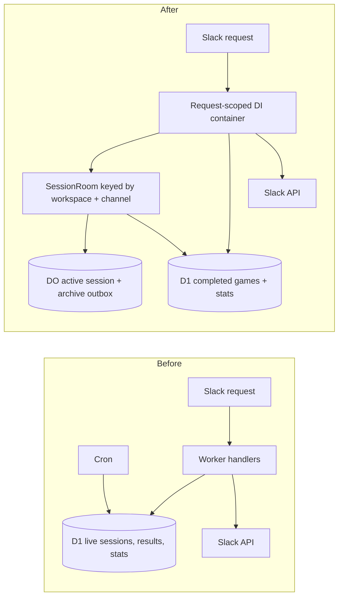
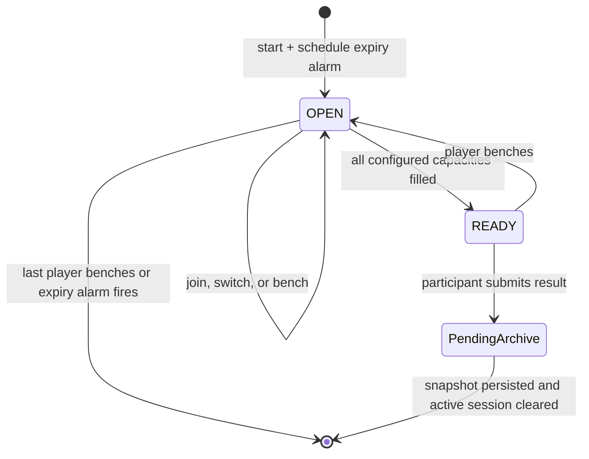

# Durable session refactor

## Responsibility shift



The `DurableOjbectSessionRoom` Durable Object owns the only mutable live aggregate for one Slack channel. D1 owns completed-game history and derived queries only. Slack messages remain projections and never become authoritative state.

## Durable Object state

```ts
interface SessionRoomState {
  activeSession: LiveSession | null;
  pendingArchives: Record<string, CompletedGame>;
}

enum SessionStatus {
  OPEN = "OPEN",
  READY = "READY",
}

interface LiveSession {
  id: string;
  workspaceId: string;
  channelId: string;
  messageTs?: string;
  creatorUserId: string;
  status: SessionStatus;
  format: GameFormat;
  teams: Team[];
  createdAt: string;
  expiresAt: string;
  readyAt?: string;
  revision: number;
}
```

The current format defines teams `A` and `B` with capacity two. Each player entry carries its format-relative position so a vacated slot does not visually move the remaining player. Counts and readiness are derived from the format rather than fixed D1 columns.

## SessionRoom method surface

```text
start(workspaceId, channelId, creatorUserId)
attachMessage(sessionId, messageTs)
getActive(sessionId)
joinOrSwitch(sessionId, userId, targetTeamId, targetPosition)
bench(sessionId, userId)
complete(sessionId, userId, scores)
amendPending(gameId, userId, scores)
flushPendingArchives()
alarm()
```

Every method validates the supplied session ID so stale Slack messages cannot mutate a newer game. State is persisted before returning to Worker code that calls Slack.

## Main transitions



Switching removes and inserts a player in one DO state transition while preserving `joinedAt`. A full target team rejects the whole transition. Benching a non-participant is a domain error; benching the last participant clears the session.

Completion first persists an immutable snapshot in `pendingArchives` and clears `activeSession`, freeing the channel immediately. Archival uses idempotent D1 inserts. Success removes the outbox entry; failure retains it and schedules an alarm retry. An edit received before archival updates the pending snapshot; after archival the same edit targets D1 and returns previous/current scores for the Slack audit reply.

## Request-scoped composition

Each Worker invocation creates a TSyringe child container. The composition boundary registers the invocation's `Env`, Cloudflare bindings, clock/ID providers, and execution context. Container-scoped repositories, clients, services, and handlers are resolved only at this boundary. Domain and application classes receive collaborators exclusively through constructors and never access the container.
